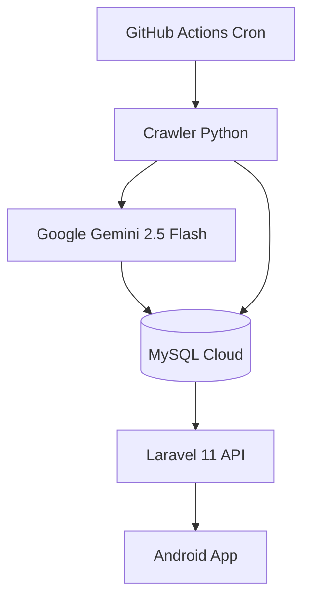

# TechByte - Core System (Monorepo) 🚀

Hệ thống tổng hợp, tóm tắt và phân tích tin tức công nghệ tự động.
Repository này chứa toàn bộ mã nguồn của hệ thống Back-end phục vụ cho Mobile App và Data Pipeline thu thập dữ liệu.

## 📑 Mục lục

- [Tổng quan](#-tổng-quan)
- [Quick Start 5 phút](#-quick-start-5-phút)
- [Cấu trúc Repository](#-cấu-trúc-repository-monorepo)
- [Tech Stack](#-tech-stack)
- [Hướng dẫn Setup Local](#-hướng-dẫn-setup-local-cho-dev-team)
- [Quy trình vận hành dữ liệu](#-quy-trình-vận-hành-dữ-liệu)
- [Sơ đồ luồng hệ thống](#-sơ-đồ-luồng-hệ-thống)
- [Danh mục API chính (Draft)](#-danh-mục-api-chính-draft)

## 📌 Tổng quan

Dự án được chia làm 2 phân hệ hoạt động độc lập để tối ưu hiệu năng:

- `/backend`: RESTful API Server xây dựng bằng **Laravel 11**. Chịu trách nhiệm giao tiếp với App Android và xử lý logic người dùng.
- `/crawler`: Data Ingestion Pipeline xây dựng bằng **Python**. Chịu trách nhiệm cào tin tức, gọi AI (Gemini) và đẩy dữ liệu vào Database.
- `/.github/workflows`: Kịch bản tự động hóa (Cron job) chạy Crawler hàng ngày.
- `/docs`: Chứa tài liệu thiết kế hệ thống và sơ đồ cơ sở dữ liệu (ERD).

## ⚡ Quick Start 5 phút

### 1) Chạy API Server (Laravel)

```bash
cd backend
composer install
cp .env.example .env
php artisan key:generate
php artisan migrate --seed
php artisan serve
```

### 2) Chạy Data Pipeline (Python)

```bash
cd ../crawler
python -m venv venv
```

Kích hoạt môi trường ảo:

Windows:

```bash
venv\Scripts\activate
```

Mac/Linux:

```bash
source venv/bin/activate
```

```bash
pip install -r requirements.txt
```

## 📂 Cấu trúc Repository (Monorepo)

```text
techbyte-backend/
├─ backend/            # Laravel API Server
├─ crawler/            # Python Data Pipeline
├─ .github/workflows/  # Cron workflow chạy crawler
└─ docs/               # Tài liệu hệ thống và ERD
```

## 🛠 Tech Stack

- **Back-end Framework:** Laravel 11 (PHP 8.2+)
- **Database:** PostgreSQL (Supabase) / MySQL Cloud
- **Data Crawler:** Python 3.10+ (BeautifulSoup, Requests)
- **AI Integration:** Google Gemini 2.5 Flash
- **CI/CD:** GitHub Actions

## ⚙️ Hướng dẫn Setup Local cho Dev Team

Để đảm bảo đồng bộ dữ liệu giữa các thành viên trong nhóm, vui lòng thực hiện đúng thứ tự sau.

### A. Setup API Server (Laravel)

1. Di chuyển vào thư mục backend:

```bash
cd backend
```

2. Cài đặt thư viện:

```bash
composer install
```

3. Thiết lập cấu hình môi trường:

```bash
cp .env.example .env
```

4. Mở file `.env` và điền thông số Database (liên hệ PM để lấy thông tin DB Cloud/Supabase).

5. Khởi tạo mã khóa ứng dụng:

```bash
php artisan key:generate
```

6. Đồng bộ Database (khởi tạo 15 bảng theo thiết kế và bơm dữ liệu mẫu vào máy local):

```bash
php artisan migrate --seed
```

7. Khởi động server:

```bash
php artisan serve
```

### B. Cấu hình Data Pipeline (Python)

1. Di chuyển vào thư mục crawler:

```bash
cd ../crawler
```

2. Tạo môi trường ảo (venv):

```bash
python -m venv venv
```

3. Kích hoạt môi trường ảo:

Windows:

```bash
venv\Scripts\activate
```

Mac/Linux:

```bash
source venv/bin/activate
```

4. Cài đặt thư viện cần thiết:

```bash
pip install -r requirements.txt
```

Lưu ý: file `requirements.txt` bao gồm `beautifulsoup4`, `requests`, `google-generativeai`, `mysql-connector-python`.

## 🔐 Biến môi trường bắt buộc

Hệ thống dùng 4 nhóm biến môi trường chính. Team chỉ commit file mẫu, không commit file chứa secret thật.

### 1) Core Laravel

| Biến        | Mục đích                                           |
| ----------- | -------------------------------------------------- |
| `APP_NAME`  | Tên ứng dụng                                       |
| `APP_ENV`   | Môi trường chạy (`local`, `staging`, `production`) |
| `APP_KEY`   | Khóa mã hóa ứng dụng Laravel                       |
| `APP_DEBUG` | Bật/tắt debug                                      |
| `APP_URL`   | URL backend                                        |

### 2) MySQL

| Biến            | Mục đích                 |
| --------------- | ------------------------ |
| `DB_CONNECTION` | Driver kết nối (`mysql`) |
| `DB_HOST`       | Host MySQL               |
| `DB_PORT`       | Port MySQL               |
| `DB_DATABASE`   | Tên database             |
| `DB_USERNAME`   | Tài khoản DB             |
| `DB_PASSWORD`   | Mật khẩu DB              |

### 3) JWT Secret

| Biến              | Mục đích                                  |
| ----------------- | ----------------------------------------- |
| `JWT_SECRET`      | Secret ký JWT                             |
| `JWT_TTL`         | Thời gian sống access token (phút)        |
| `JWT_REFRESH_TTL` | Thời gian sống refresh token (phút)       |
| `JWT_ALGO`        | Thuật toán ký token (khuyến nghị `HS256`) |

### 4) Gemini API Key

| Biến             | Mục đích                                         |
| ---------------- | ------------------------------------------------ |
| `GEMINI_API_KEY` | API Key dùng gọi Google Gemini                   |
| `GEMINI_MODEL`   | Model Gemini mặc định (ví dụ `gemini-2.5-flash`) |

## 🛡 Chính sách bảo mật `.gitignore`

- Ignore toàn bộ file `.env` và `.env.*` ở cả root, `backend`, `crawler`.
- Chỉ cho phép commit file mẫu `.env.example`.
- Giá trị thật của `DB_PASSWORD`, `JWT_SECRET`, `GEMINI_API_KEY` phải nằm trong máy local hoặc GitHub Secrets.

## 🔧 Secret cho GitHub Actions (daily crawler)

Trong GitHub repository settings, tạo các secrets sau để workflow `daily_crawl.yml` đọc khi chạy:

- `DB_HOST`
- `DB_PORT`
- `DB_DATABASE`
- `DB_USERNAME`
- `DB_PASSWORD`
- `JWT_SECRET`
- `GEMINI_API_KEY`

Tùy chọn: tạo Repository Variable `GEMINI_MODEL` để đổi model mà không cần sửa code.

## ⚙️ Quy trình vận hành dữ liệu

1. GitHub Actions tự động kích hoạt hàng ngày để chạy script trong thư mục `/crawler`.
2. Script Python cào tin, gọi Gemini 2.5 Flash để tóm tắt và trích xuất specs.
3. Dữ liệu được lưu trực tiếp vào MySQL Cloud qua lệnh `INSERT/UPDATE`.
4. Laravel API truy xuất dữ liệu từ MySQL và trả về định dạng JSON cho Android App.

## 🧭 Sơ đồ luồng hệ thống



## 🔌 Danh mục API chính (Draft)

Prefix chuẩn: `/api/techbyte`

| Method | Endpoint                               | Mô tả                                  | Ghi chú |
| ------ | -------------------------------------- | -------------------------------------- | ------- |
| POST   | `/api/techbyte/auth/login`             | Đăng nhập lấy JWT Token                | Public  |
| GET    | `/api/techbyte/articles`               | Danh sách bài báo (phân trang)         | Public  |
| GET    | `/api/techbyte/articles/{id}`          | Chi tiết bài báo (nội dung tóm tắt)    | Public  |
| GET    | `/api/techbyte/articles/{id}/specs`    | JSON thông số kỹ thuật (để vẽ biểu đồ) | Public  |
| GET    | `/api/techbyte/articles/{id}/comments` | Danh sách bình luận theo bài viết      | Public  |
| POST   | `/api/techbyte/comments`               | Gửi bình luận mới                      | Auth    |
| POST   | `/api/techbyte/articles/{id}/like`     | Like bài viết                          | Auth    |
| POST   | `/api/techbyte/articles/{id}/bookmark` | Lưu bài viết                           | Auth    |
| GET    | `/api/techbyte/me`                     | Thông tin người dùng hiện tại          | Auth    |
